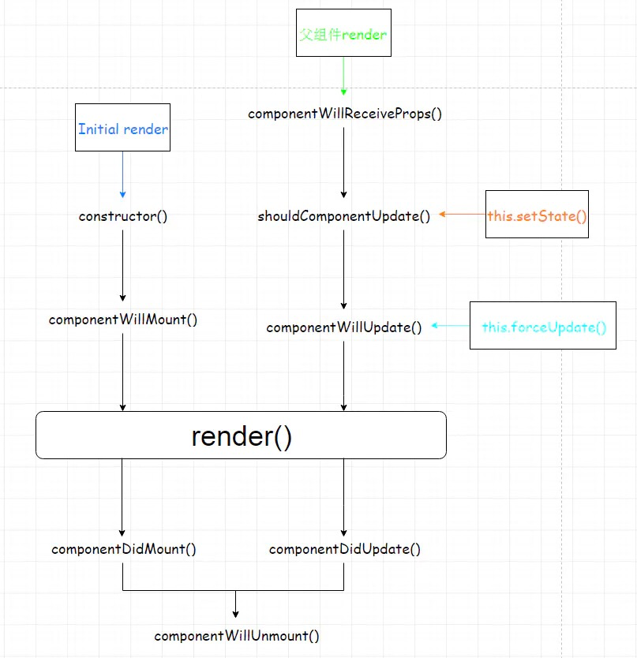

#  react 入门

## 什么是 React

用于构建用户界面的 javascript 库。

## props介绍

**this绑定的四种方式**

1. 在 constructor 内绑定  推荐

   ```jsx
   this.handleClick = this.handleClick.bind(this)
   ```

2. 直接在 jsx 元素进行绑定  不推荐

   ```jsx
   <button onClick={this.handleClick.bind(this)}></button>
   ```

   缺点：会造成额外的渲染，影响性能

3. 使用箭头函数，ES6类字段  :star: 推荐 

   ```jsx
   const handleClick = () => {}
   ```

4. 使用箭头函数，在 jsx 元素直接操作  不推荐

   ```jsx
   <button onClick={() => this.handleClick()}></button>
   ```

## state介绍

**state更新时机**

- setState 异步更新，批量延迟更新 多个setState调用，合并处理，高效
  - React 控制的事件处理程序（onClick, onChange)、生命周期钩子函数 不会同步更新 state
- setState 同步更新
  - 原生js绑定的事件、setTimeout

## 生命周期

### 参考图

[React v16.3及以后生命周期图](https://projects.wojtekmaj.pl/react-lifecycle-methods-diagram/)

React16.3之前生命周期图：



### 生命周期

**挂载阶段**

- constructor(props)

作用：初始化 state，this 绑定

- ~~componentWillMount~~

v16.3 已过时

`render`之前调用，只会调用一次，很少使用。

`setState`不会引起重新渲染，因为在执行的时候还未到达`render`阶段， 使用同步的`setState`。

作用：产生副作用，如：订阅

- static getDerivedStateFromProps()
- render

类声明时唯一必要的方法。不负责组件的实际渲染 工作，知识返回一个UI的描述。

⚠️注意：必须是一个 纯函数，在这里不能改变`state`,不能 执行任何有副作用的操作

作用：计算`props/state`返回对应的结果；通过`React.createElement`转换为 `vDOM`对象模型。

- componentDidMount

只会调用一次，能获取到真实的dom。

在SSR中，也只能在浏览器端调用 ，因为server端不可能产生dom树

作用：

	1. 获取数据，获取真实dom；
	2. 进行数据请求，进行数据更改，可以保证获取到数据时，组件已经处于挂在状态。保证在任何情况下，只会调用一次，不会发送多余的数据请求；
	3. 直接操作真实dom，初始化第三方库。

**更新阶段**

- ~~componentWillReceiveProps(nextProps)~~

props引起的组件更新过程。

只要父组件的`render`函数被调用，无论父组件传递给子组件的`props`有没有改变，都会触发。 

- static getDerivedStateFromProps()

- shouldComponentUpdate

尽量遵循默认行为，状态改变 ，组件就会被重新渲染。

作用：减少组件不必要的渲染，提高性能。

- ~~componentWillUpdate(nextProps, nextState)~~

很少使用，不能调用`setState`

- render
- getSnapshotBeforeUpdate()
- componentDidUpdate(prevProps, prevState)

更新完成，有机会操作`dom`

作用：根据需要判断是否发送网络请求。

**卸载阶段**

- componentWillUnmount

作用：做一些清理工作，如：定时器、移除事件监听、取消网络请求。

**错误处理阶段**

- static getDerivedStateFromError()
- componentDidCatch(error, info)